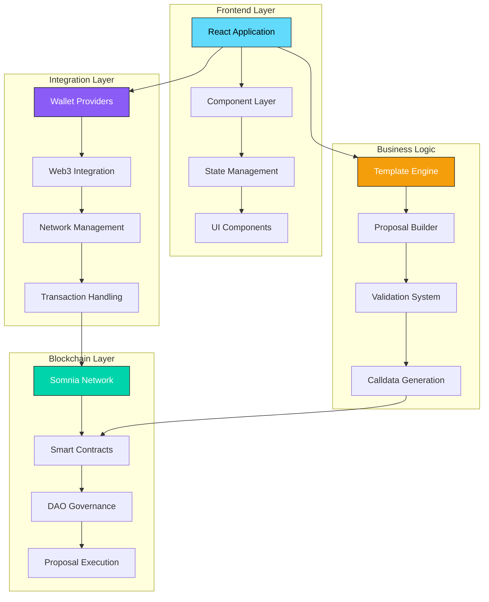
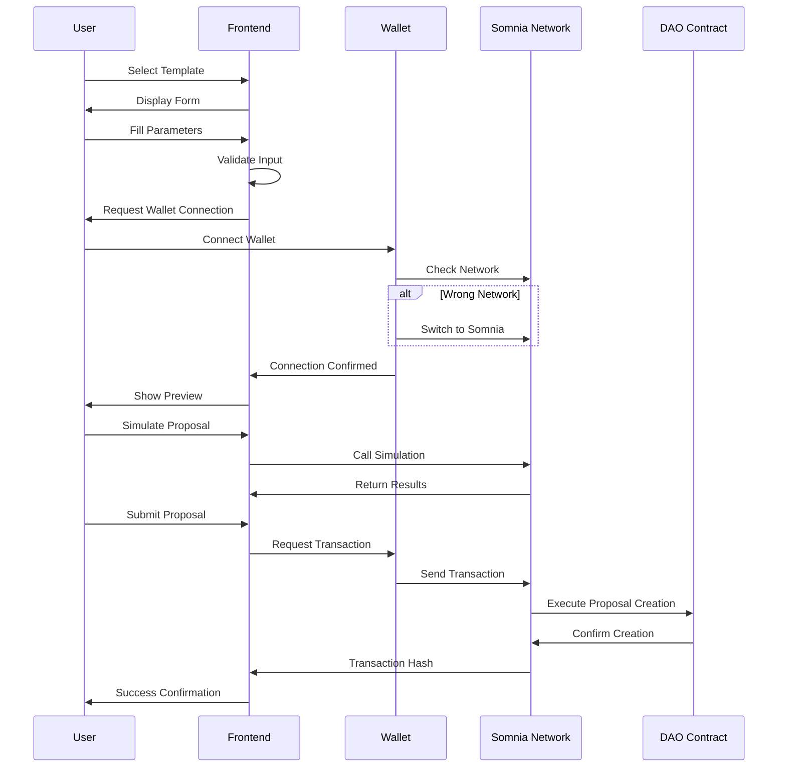
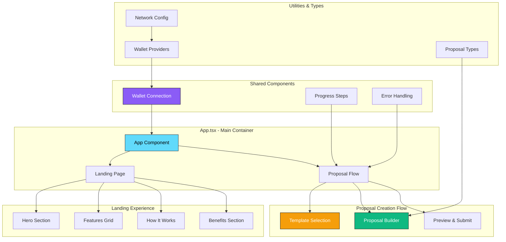
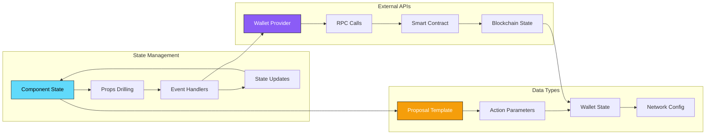

# 🏛️ Synora

<div align="center">


**Transform complex smart contract proposals into simple forms**

[](https://reactjs.org/)
[](https://www.typescriptlang.org/)
[](https://tailwindcss.com/)
[](https://vitejs.dev/)
[](https://somnia.network/)

[🚀 Live Demo](https://governance-generator.somnia.network) • [📖 Documentation](#documentation) • [🛠️ Installation](#installation) • [🏗️ Architecture](#architecture)

</div>

---

## 📋 Table of Contents

- [Overview](#overview)
- [Features](#features)
- [Architecture](#architecture)
- [Installation](#installation)
- [Usage](#usage)
- [Project Structure](#project-structure)
- [Components](#components)
- [Wallet Integration](#wallet-integration)
- [Environment Configuration](#environment-configuration)
- [Development](#development)
- [Deployment](#deployment)
- [Contributing](#contributing)
- [License](#license)

---

## 🌟 Overview

The **Synora** is a revolutionary no-code platform that democratizes DAO governance on the Somnia blockchain. It transforms complex smart contract interactions into intuitive forms, enabling anyone to create, simulate, and submit governance proposals without technical expertise.

### 🎯 Mission
Make DAO governance accessible to everyone by eliminating technical barriers while maintaining security and accuracy.

### 🔥 Key Highlights
- **Zero Coding Required**: Point-and-click proposal creation
- **Multi-Wallet Support**: MetaMask, Core Wallet, Coinbase Wallet integration
- **Somnia Native**: Optimized for Somnia blockchain with automatic network switching
- **Template System**: Pre-built templates for common governance actions
- **Real-time Simulation**: Test proposals before submission
- **Glass Morphism UI**: Modern, vibrant interface with smooth animations

---

## ✨ Features

### 🏛️ **Governance Templates**
- **Treasury Management**: Token transfers from DAO treasury
- **Parameter Updates**: Protocol setting modifications
- **Contract Upgrades**: Proxy contract implementation updates
- **Role Management**: Admin permissions and access control

### 🔗 **Blockchain Integration**
- **Multi-Wallet Support**: Compatible with major Web3 wallets
- **Network Auto-Detection**: Automatic Somnia network configuration
- **Real-time Validation**: Address and parameter verification
- **Gas Estimation**: Accurate transaction cost prediction

### 🎨 **User Experience**
- **Intuitive Interface**: Step-by-step proposal creation
- **Visual Feedback**: Real-time form validation and error handling
- **Responsive Design**: Optimized for desktop and mobile
- **Glass Morphism**: Modern UI with backdrop blur effects

### 🛡️ **Security & Reliability**
- **Input Validation**: Comprehensive parameter checking
- **Simulation Testing**: Pre-execution proposal validation
- **Error Prevention**: Built-in safeguards against common mistakes
- **Secure Key Management**: Environment-based configuration

---

## 🏗️ Architecture

### 📊 System Architecture Diagram



### 🔄 Application Flow Diagram



### 🧩 Component Architecture



### 📁 Data Flow Architecture



---

## 🚀 Installation

### Prerequisites
- **Node.js** 18.0.0 or higher
- **npm** or **yarn** package manager
- **Git** for version control
- **Web3 Wallet** (MetaMask, Core Wallet, etc.)

### Quick Start

```bash
# Clone the repository
git clone https://github.com/your-org/governance-proposal-generator.git
cd governance-proposal-generator

# Install dependencies
npm install

# Copy environment configuration
cp .env.example .env

# Configure your environment variables
nano .env

# Start development server
npm run dev
```

### Environment Setup

Create a `.env` file in the root directory:

```env
# Somnia Network Configuration
VITE_SOMNIA_RPC_URL=https://rpc.somnia.network
VITE_SOMNIA_CHAIN_ID=2648
VITE_SOMNIA_CHAIN_NAME=Somnia
VITE_SOMNIA_CURRENCY_NAME=STM
VITE_SOMNIA_CURRENCY_SYMBOL=STM
VITE_SOMNIA_CURRENCY_DECIMALS=18
VITE_SOMNIA_BLOCK_EXPLORER=https://explorer.somnia.network

# Optional: Backend Services (Keep Private)
SOMNIA_PRIVATE_KEY=your_private_key_here
SOMNIA_WALLET_ADDRESS=your_wallet_address_here
```

---

## 📖 Usage

### 1. **Template Selection**
Choose from pre-built governance templates:
- **Treasury Transfer**: Move funds from DAO treasury
- **Parameter Update**: Modify protocol settings
- **Contract Upgrade**: Update smart contract implementations
- **Role Management**: Grant/revoke admin permissions

### 2. **Proposal Building**
Fill out intuitive forms with:
- **Recipient addresses** with validation
- **Token amounts** with decimal support
- **Contract parameters** with type checking
- **Role assignments** with dropdown selections

### 3. **Wallet Connection**
Connect your preferred wallet:
- **MetaMask**: Browser extension integration
- **Core Wallet**: Multi-chain wallet support
- **Coinbase Wallet**: Institutional-grade security
- **WalletConnect**: Mobile wallet connectivity

### 4. **Preview & Simulation**
Before submission:
- **Review** all proposal details
- **Simulate** execution on testnet
- **Estimate** gas costs
- **Validate** all parameters

### 5. **Proposal Submission**
Submit to the DAO with:
- **One-click** submission process
- **Real-time** transaction tracking
- **Confirmation** notifications
- **Explorer** links for verification

---

## 📂 Project Structure

```
governance-proposal-generator/
├── 📁 public/                    # Static assets
│   ├── vite.svg                 # Vite logo
│   └── index.html               # HTML template
├── 📁 src/                      # Source code
│   ├── 📁 components/           # React components
│   │   ├── LandingPage.tsx      # Landing page component
│   │   ├── ProposalTemplates.tsx # Template selection
│   │   ├── ProposalBuilder.tsx  # Form builder
│   │   ├── ProposalPreview.tsx  # Preview & submission
│   │   └── WalletConnection.tsx # Wallet integration
│   ├── 📁 types/               # TypeScript definitions
│   │   ├── proposal.ts         # Proposal interfaces
│   │   └── wallet.ts           # Wallet interfaces
│   ├── 📁 utils/               # Utility functions
│   │   └── walletProviders.ts  # Wallet configurations
│   ├── App.tsx                 # Main application
│   ├── main.tsx               # Application entry
│   └── index.css              # Global styles
├── 📁 config/                  # Configuration files
│   ├── tailwind.config.js     # Tailwind CSS config
│   ├── vite.config.ts         # Vite configuration
│   └── tsconfig.json          # TypeScript config
├── .env.example               # Environment template
├── .env                       # Environment variables
├── package.json               # Dependencies
└── README.md                  # Documentation
```

---

## 🧩 Components

### 🏠 **LandingPage.tsx**
**Purpose**: Marketing and onboarding experience
- Hero section with value proposition
- Feature highlights and benefits
- Call-to-action buttons
- Social proof and testimonials

**Key Features**:
- Responsive design with mobile optimization
- Smooth scroll animations
- Interactive feature cards
- Gradient backgrounds with glass morphism

### 📋 **ProposalTemplates.tsx**
**Purpose**: Template selection interface
- Categorized template display
- Template descriptions and parameters
- Visual template cards with icons
- Category filtering and search

**Template Categories**:
- **Treasury**: Financial operations
- **Governance**: Protocol changes
- **Technical**: Smart contract updates
- **Roles**: Access control management

### 🛠️ **ProposalBuilder.tsx**
**Purpose**: Form-based proposal creation
- Dynamic form generation from templates
- Real-time input validation
- Parameter type checking
- Action management and preview

**Form Features**:
- Address validation with checksum
- Amount formatting with decimals
- Dropdown selections for enums
- Error handling with user feedback

### 👁️ **ProposalPreview.tsx**
**Purpose**: Proposal review and submission
- Complete proposal overview
- Action list with parameters
- Simulation and testing tools
- Submission interface with wallet integration

**Preview Features**:
- Calldata generation and display
- Gas estimation and cost calculation
- Simulation results with success/error states
- Transaction tracking and confirmation

### 💳 **WalletConnection.tsx**
**Purpose**: Web3 wallet integration
- Multi-wallet provider support
- Network detection and switching
- Connection state management
- Error handling and user guidance

**Wallet Features**:
- Automatic wallet detection
- Network configuration assistance
- Connection status indicators
- Secure disconnection handling

---

## 🔗 Wallet Integration

### Supported Wallets

| Wallet | Status | Features |
|--------|--------|----------|
| 🦊 **MetaMask** | ✅ Active | Browser extension, mobile app |
| 🔷 **Core Wallet** | ✅ Active | Multi-chain, Avalanche ecosystem |
| 🔵 **Coinbase Wallet** | ✅ Active | Institutional grade, mobile |
| 📱 **WalletConnect** | 🚧 Coming Soon | Mobile wallet connectivity |

### Integration Architecture

```typescript
interface WalletProvider {
  id: string;
  name: string;
  icon: string;
  description: string;
  downloadUrl?: string;
  isInstalled: () => boolean;
  connect: () => Promise<string>;
  disconnect?: () => Promise<void>;
  switchNetwork?: () => Promise<void>;
}
```

### Network Configuration

```typescript
const SOMNIA_NETWORK: SomniaNetwork = {
  chainId: '0xa58',  // 2648 in hex
  chainName: 'Somnia',
  nativeCurrency: {
    name: 'STM',
    symbol: 'STM',
    decimals: 18,
  },
  rpcUrls: ['https://rpc.somnia.network'],
  blockExplorerUrls: ['https://explorer.somnia.network'],
};
```

---

## ⚙️ Environment Configuration

### Required Variables

```env
# Network Configuration
VITE_SOMNIA_RPC_URL=https://rpc.somnia.network
VITE_SOMNIA_CHAIN_ID=2648
VITE_SOMNIA_CHAIN_NAME=Somnia
VITE_SOMNIA_CURRENCY_SYMBOL=STM
VITE_SOMNIA_CURRENCY_DECIMALS=18
VITE_SOMNIA_BLOCK_EXPLORER=https://explorer.somnia.network
```

### Optional Variables

```env
# Development & Testing
SOMNIA_PRIVATE_KEY=your_private_key_here
SOMNIA_WALLET_ADDRESS=your_wallet_address_here

# Analytics & Monitoring
VITE_ANALYTICS_ID=your_analytics_id
VITE_SENTRY_DSN=your_sentry_dsn
```

### Security Best Practices

- ✅ Use environment variables for sensitive data
- ✅ Never commit private keys to version control
- ✅ Use different configurations for dev/staging/prod
- ✅ Validate all environment variables at startup
- ✅ Use HTTPS for all external API calls

---

## 🛠️ Development

### Available Scripts

```bash
# Development
npm run dev          # Start development server
npm run build        # Build for production
npm run preview      # Preview production build
npm run lint         # Run ESLint
npm run type-check   # TypeScript type checking

# Testing
npm run test         # Run test suite
npm run test:watch   # Run tests in watch mode
npm run test:coverage # Generate coverage report

# Deployment
npm run deploy       # Deploy to production
npm run deploy:staging # Deploy to staging
```

### Development Workflow

1. **Feature Development**
   ```bash
   git checkout -b feature/new-template
   npm run dev
   # Make changes
   npm run lint
   npm run type-check
   git commit -m "feat: add new proposal template"
   ```

2. **Testing**
   ```bash
   npm run test
   npm run test:coverage
   # Ensure >90% coverage
   ```

3. **Code Review**
   ```bash
   git push origin feature/new-template
   # Create pull request
   # Address review feedback
   ```

4. **Deployment**
   ```bash
   git checkout main
   git merge feature/new-template
   npm run build
   npm run deploy
   ```

### Code Style Guidelines

- **TypeScript**: Strict mode enabled
- **ESLint**: Airbnb configuration
- **Prettier**: Automatic code formatting
- **Husky**: Pre-commit hooks
- **Conventional Commits**: Standardized commit messages

---

## 🚀 Deployment

### Production Build

```bash
# Build optimized production bundle
npm run build

# Preview production build locally
npm run preview
```

### Deployment Options

#### 1. **Vercel** (Recommended)
```bash
# Install Vercel CLI
npm i -g vercel

# Deploy
vercel --prod
```

#### 2. **Netlify**
```bash
# Build and deploy
npm run build
netlify deploy --prod --dir=dist
```

#### 3. **AWS S3 + CloudFront**
```bash
# Build
npm run build

# Deploy to S3
aws s3 sync dist/ s3://your-bucket-name

# Invalidate CloudFront
aws cloudfront create-invalidation --distribution-id YOUR_ID --paths "/*"
```

### Environment-Specific Configurations

```bash
# Production
VITE_SOMNIA_RPC_URL=https://rpc.somnia.network
VITE_ENVIRONMENT=production

# Staging
VITE_SOMNIA_RPC_URL=https://testnet-rpc.somnia.network
VITE_ENVIRONMENT=staging

# Development
VITE_SOMNIA_RPC_URL=http://localhost:8545
VITE_ENVIRONMENT=development
```

---

## 🤝 Contributing

We welcome contributions from the community! Here's how to get involved:

### 🐛 Bug Reports

1. **Search** existing issues first
2. **Create** detailed bug report with:
   - Steps to reproduce
   - Expected vs actual behavior
   - Browser and wallet information
   - Screenshots or videos

### 💡 Feature Requests

1. **Check** roadmap and existing requests
2. **Describe** the feature and use case
3. **Provide** mockups or examples
4. **Discuss** implementation approach

### 🔧 Pull Requests

1. **Fork** the repository
2. **Create** feature branch from `main`
3. **Follow** coding standards and conventions
4. **Add** tests for new functionality
5. **Update** documentation as needed
6. **Submit** PR with clear description

### 📋 Development Setup

```bash
# Fork and clone
git clone https://github.com/your-username/governance-proposal-generator.git
cd governance-proposal-generator

# Install dependencies
npm install

# Create feature branch
git checkout -b feature/amazing-feature

# Make changes and test
npm run dev
npm run test
npm run lint

# Commit and push
git commit -m "feat: add amazing feature"
git push origin feature/amazing-feature
```

### 🏆 Recognition

Contributors will be recognized in:
- **README** contributors section
- **Release notes** for significant contributions
- **Discord** community highlights
- **Annual** contributor appreciation events

---

## 📄 License

This project is licensed under the **MIT License** - see the [LICENSE](LICENSE) file for details.

```
MIT License

Copyright (c) 2025 Governance Proposal Generator

Permission is hereby granted, free of charge, to any person obtaining a copy
of this software and associated documentation files (the "Software"), to deal
in the Software without restriction, including without limitation the rights
to use, copy, modify, merge, publish, distribute, sublicense, and/or sell
copies of the Software, and to permit persons to whom the Software is
furnished to do so, subject to the following conditions:

The above copyright notice and this permission notice shall be included in all
copies or substantial portions of the Software.

THE SOFTWARE IS PROVIDED "AS IS", WITHOUT WARRANTY OF ANY KIND, EXPRESS OR
IMPLIED, INCLUDING BUT NOT LIMITED TO THE WARRANTIES OF MERCHANTABILITY,
FITNESS FOR A PARTICULAR PURPOSE AND NONINFRINGEMENT. IN NO EVENT SHALL THE
AUTHORS OR COPYRIGHT HOLDERS BE LIABLE FOR ANY CLAIM, DAMAGES OR OTHER
LIABILITY, WHETHER IN AN ACTION OF CONTRACT, TORT OR OTHERWISE, ARISING FROM,
OUT OF OR IN CONNECTION WITH THE SOFTWARE OR THE USE OR OTHER DEALINGS IN THE
SOFTWARE.
```

---

## 🙏 Acknowledgments

- **Somnia Network** - For providing the blockchain infrastructure
- **React Team** - For the amazing frontend framework
- **Tailwind CSS** - For the utility-first CSS framework
- **Vite** - For the lightning-fast build tool
- **Web3 Community** - For wallet standards and best practices
- **Open Source Contributors** - For making this project possible

---

## 📞 Support & Community

### 🆘 Getting Help

- **Documentation**: [docs.governance-generator.com](https://docs.governance-generator.com)
- **Discord**: [Join our community](https://discord.gg/governance-generator)
- **GitHub Issues**: [Report bugs or request features](https://github.com/your-org/governance-proposal-generator/issues)
- **Email**: support@governance-generator.com

### 🌐 Community Links

- **Website**: [governance-generator.com](https://governance-generator.com)
- **Twitter**: [@GovernanceGen](https://twitter.com/GovernanceGen)
- **Medium**: [Technical blog and updates](https://medium.com/@governance-generator)
- **YouTube**: [Video tutorials and demos](https://youtube.com/@governance-generator)

### 📊 Project Stats


---

<div align="center">

**Built with ❤️ for the Somnia ecosystem**

[⭐ Star this repo](https://github.com/your-org/governance-proposal-generator) • [🐛 Report Bug](https://github.com/your-org/governance-proposal-generator/issues) • [💡 Request Feature](https://github.com/your-org/governance-proposal-generator/issues)

</div>